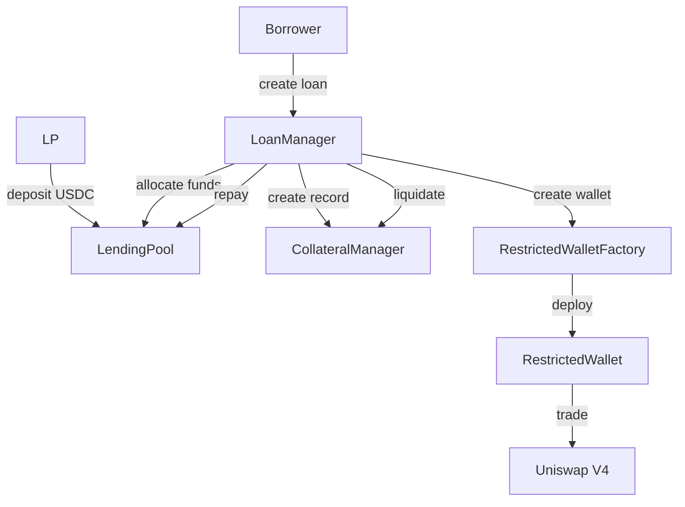

# Architecture

## System Overview

Invalend Protocol implements a modular architecture that separates concerns between lending, trading, and risk management. The system consists of five core smart contracts and a React-based frontend, deployed on Base Sepolia testnet.

## Smart Contract Architecture

### Core Contracts

#### 1. LendingPool.sol - ERC-4626 Vault

**Purpose**: Manages LP deposits and provides funding for loans

**Key Functions**:

- `deposit(uint256 assets)` - LP deposits USDC
- `withdraw(uint256 assets)` - LP withdraws USDC
- `allocateFunds(address recipient, uint256 amount)` - Allocate to borrowers
- `repayFunds(address borrower, uint256 amount)` - Receive repayments

**Features**:

- ERC-4626 compliant vault for USDC deposits
- Share-based accounting with yield accrual
- Yield simulation (6% APY)
- Pool funding allocation for loans

#### 2. LoanManager.sol - Core Orchestrator

**Purpose**: Manages 20/80 prefunding mechanism and loan lifecycle

**Key Functions**:

- `createLoan(uint256 loanAmount)` - Create new loan
- `repayLoan()` - Repay active loan
- `liquidateLoan(address borrower)` - Liquidate overdue loan
- `getLoanInfo(address borrower)` - Get loan details

**Features**:

- Manages 20/80 prefunding mechanism
- Creates and tracks loan lifecycle
- Integrates with CollateralManager and LendingPool
- Handles loan creation, repayment, and liquidation

#### 3. CollateralManager.sol - Margin Tracker

**Purpose**: Tracks 20% borrower collateral and validates margin requirements

**Key Functions**:

- `createLoanRecord(address borrower, uint256 margin, uint256 loan)` - Create record
- `validateMargin(uint256 marginAmount, uint256 loanAmount)` - Validate 20% ratio
- `isLiquidatable(address borrower)` - Check liquidation eligibility

**Features**:

- Tracks 20% borrower collateral
- Validates margin requirements
- Manages loan records and status
- Time-based liquidation logic (30 days)

#### 4. RestrictedWallet.sol - Trading Wallet

**Purpose**: Enables secure trading with chain-enforced restrictions

**Key Functions**:

- `swapExactInputSingleV4(PoolKey, uint256, uint256, uint256)` - Execute V4 swap
- `getBalance(address token)` - Get token balance
- `addWhitelistedToken(address token)` - Whitelist tokens
- `execute(address target, bytes data)` - Execute approved calls

**Features**:

- Uniswap V4 integration for trading
- Whitelist enforcement for protocols
- Token balance management
- Swap execution with slippage protection

#### 5. RestrictedWalletFactory.sol - Wallet Creator

**Purpose**: Creates and manages restricted wallets for each borrower

**Key Functions**:

- `getOrCreateWallet(address borrower)` - Get/create wallet
- `getWalletAddress(address borrower)` - Get wallet address

**Features**:

- Deploys RestrictedWallet per borrower
- Manages wallet ownership
- Integrates with LoanManager

### Contract Interactions



## Frontend Architecture

### Technology Stack

- **Framework**: Next.js 14 with TypeScript
- **Styling**: Tailwind CSS with custom design system
- **Web3**: Wagmi v2 for Ethereum interactions
- **State Management**: React hooks with custom state
- **UI Components**: Custom components with Obsidian Cyan design system

### Key Components

#### 1. Pool Management

```typescript
// PoolPage.tsx - LP interface
- DepositForm.tsx - USDC deposit form
- WithdrawForm.tsx - USDC withdrawal form
- PoolStats.tsx - Vault statistics display
```

#### 2. Loan Management

```typescript
// LoanPage.tsx - Borrower interface
- Loanform.tsx - Loan creation form
- LoanInfoCard.tsx - Active loan display
- LoanStatusWidget.tsx - Loan status monitoring
```

#### 3. Trading Interface

```typescript
// TradingPage.tsx - Trading interface
- Token selection and amount input
- Slippage configuration
- Swap execution with V4 integration
- Balance monitoring
```

### Custom Hooks

#### 1. useLoan.ts - Loan Management

```typescript
// Core hooks
- useCreateLoan() - Create new loan
- useUserLoanInfo() - Get loan information
- useRepayLoan() - Repay active loan
```

#### 2. useTradingHooks.ts - Trading Logic

```typescript
// Trading hooks
- useTradingHooks() - Main trading logic
- useRestrictedWalletBalance() - Get wallet balances
- executeSwap() - Execute V4 swaps
```

## Uniswap V4 Integration

### V4 Contracts Used

- **PoolManager**: `0x05E73354cFDd6745C338b50BcFDfA3Aa6fA03408`
- **Universal Router**: `0x492E6456D9528771018DeB9E87ef7750EF184104`
- **Position Manager**: `0x4B2C77d209D3405F41a037Ec6c77F7F5b8e2ca80`
- **Permit2**: `0x000000000022D473030F116dDEE9F6B43aC78BA3`

### Supported Pools

- **USDC/ETH**: Pool ID `0x82aa315190ba72c31a00655a3982a66cb9ead8cb97952ae0437665fe6e37ef02`
- **USDC/BTC**: Pool ID `0xc839bf388664a4981e411a9f33eb8e0a828592f5a419bce34e539641e600f2ee`
- **ETH/BTC**: Pool ID `0xfd4810754a554cf52dd702e298fae2dd2d0aa120d73fcca9e0e7306c89cf111d`

### Swap Implementation

```typescript
// V4 swap execution
const executeSwap = async (tokenIn, tokenOut, amount, slippage) => {
  const swapParams = prepareSwapParams(tokenIn, tokenOut, amount, slippage);
  const swapData = encodeV4SwapData(swapParams);

  await writeContract({
    address: restrictedWalletAddress,
    abi: RESTRICTED_WALLET_ABI,
    functionName: "execute",
    args: [UNISWAP_V4_ROUTER, swapData],
  });
};
```

## Security Architecture

### Access Control

- **Ownable pattern** for admin functions
- **Role-based access** for critical operations
- **ReentrancyGuard** on all state-changing functions
- **Input validation** on all external calls

### Restriction Enforcement

- **Whitelist-based** protocol access
- **Function selector** validation
- **Token whitelist** enforcement
- **No external transfers** allowed

### Risk Management

- **Time-based liquidation** (30 days)
- **Margin requirement** validation (20%)
- **Slippage protection** on swaps
- **Balance checks** before operations

## Data Flow

### Loan Creation Flow

1. **Borrower** calls `createLoan(amount)`
2. **LoanManager** validates margin requirement
3. **CollateralManager** creates loan record
4. **LendingPool** allocates 80% funding
5. **RestrictedWalletFactory** creates trading wallet
6. **Combined capital** sent to restricted wallet

### Trading Flow

1. **Borrower** connects to trading interface
2. **System** checks for active loan
3. **User** selects tokens and amount
4. **RestrictedWallet** executes V4 swap
5. **Transaction** recorded on-chain
6. **Balance** updated in real-time

### Repayment Flow

1. **Borrower** calls `repayLoan()`
2. **RestrictedWallet** withdraws all tokens
3. **LoanManager** calculates repayment amount
4. **LendingPool** receives 80% + interest
5. **Borrower** receives remaining collateral
6. **Loan** marked as repaid

## Deployment Architecture

### Network Configuration

- **Network**: Base Sepolia (Chain ID: 84532)
- **RPC**: `https://sepolia.base.org`
- **Explorer**: `https://sepolia.basescan.org`

### Contract Addresses

```typescript
const CONTRACT_ADDRESSES = {
  MOCK_USDC: "0x98Ca29e25df55BcE438a2F93013fB9790edaf342",
  LENDING_POOL: "0x0CFBf6055f5d4546D25ADb937a6FbC49dB2C5e53",
  LOAN_MANAGER: "0xDE63F87cE22E62c8a668DcF2f0869d07Be62944d",
  COLLATERAL_MANAGER: "0xE85F7074d5b36E776001B6bc675531eAc995C642",
  RESTRICTED_WALLET_FACTORY: "0xA8bE9eb8dF632fCD4dfB71D7A7199ebC8238d7C9",
  RESTRICTED_WALLET: "0xCA6913E22193cc6D0A125127ffe87953b1170A66",
};
```

## Performance Considerations

### Gas Optimization

- **Batch operations** where possible
- **Efficient storage** patterns
- **Minimal external calls**
- **Optimized loops** and calculations

### Scalability

- **Modular architecture** for easy upgrades
- **Factory pattern** for wallet creation
- **Event-based** monitoring
- **Stateless** frontend components

## Monitoring & Analytics

### On-Chain Events

- `LoanCreated` - New loan created
- `LoanRepaid` - Loan repaid
- `LoanLiquidated` - Loan liquidated
- `V4TradeExecuted` - Swap executed
- `FundsAllocated` - Funds allocated to borrower

### Frontend Monitoring

- **Real-time balance** updates
- **Transaction status** tracking
- **Error handling** and user feedback
- **Performance metrics** collection

## Future Architecture Considerations

### Planned Enhancements

1. **Oracle Integration** - Chainlink price feeds (planned)
2. **Real Liquidation Engine** - Price-based liquidation (planned)
3. **Multi-Asset Support** - Beyond USDC/ETH/BTC (planned)
4. **Cross-Chain Deployment** - Multi-chain support (planned)
5. **Governance System** - Community governance (planned)

### Scalability Improvements

1. **Layer 2 Optimization** - Base-specific optimizations
2. **Batch Processing** - Multiple operations in single transaction
3. **Caching Layer** - Frontend data caching
4. **API Layer** - Backend service integration

---

_Ready to understand the core flow? Check out our [Core Flow](/docs/core-flow) or explore the [Smart Contracts](/docs/smart-contracts)._
