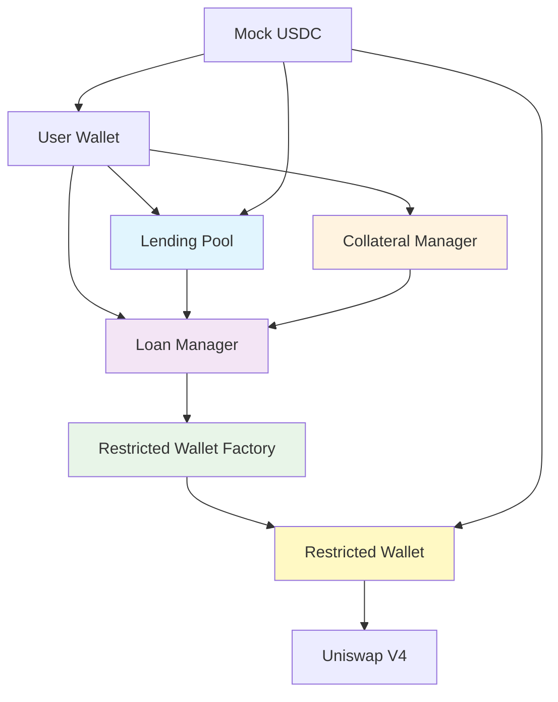

# Smart Contracts

## Contract Overview

Invalend Protocol consists of five core smart contracts deployed on Base Sepolia testnet. All contracts are verified and can be viewed on the Base Sepolia Blockscout explorer.

## Network Information

- **Chain**: Base Sepolia Testnet
- **Chain ID**: 84532
- **Native Token**: ETH (for gas fees)
- **Block Explorer**: [Base Sepolia Blockscout](https://sepolia.basescan.org)
- **RPC Endpoint**: https://sepolia.base.org

## Contract Addresses

### Core Protocol Contracts

#### 1. **LendingPool Contract**
The main contract that manages USDC deposits and handles yield distribution.

- **Address**: [`0x0CFBf6055f5d4546D25ADb937a6FbC49dB2C5e53`](https://sepolia.basescan.org/address/0x0CFBf6055f5d4546D25ADb937a6FbC49dB2C5e53)
- **Functions**: Deposit, Withdraw, Yield Distribution, Pool Statistics
- **Key Features**:
  - Yield generation for depositors
  - Automated yield calculations
  - Liquidity pool management
  - User balance tracking

#### 2. **LoanManager Contract**
Manages loan creation, collateral requirements, and liquidations.

- **Address**: [`0xDE63F87cE22E62c8a668DcF2f0869d07Be62944d`](https://sepolia.basescan.org/address/0xDE63F87cE22E62c8a668DcF2f0869d07Be62944d)
- **Functions**: Create Loans, Manage Collateral, Handle Liquidations
- **Key Features**:
  - 20% collateral requirement
  - 5x maximum leverage
  - 30-day loan terms
  - Time-based liquidation protection

#### 3. **CollateralManager Contract**
Handles collateral deposits, calculations, and risk management.

- **Address**: [`0xE85F7074d5b36E776001B6bc675531eAc995C642`](https://sepolia.basescan.org/address/0xE85F7074d5b36E776001B6bc675531eAc995C642)
- **Functions**: Collateral Validation, Risk Assessment, Position Monitoring
- **Key Features**:
  - Real-time collateral valuation
  - Health factor calculations
  - Liquidation threshold monitoring
  - Multi-asset collateral support (planned)

#### 4. **RestrictedWalletFactory**
Creates and manages restricted smart contract wallets for secure trading.

- **Address**: [`0xA8bE9eb8dF632fCD4dfB71D7A7199ebC8238d7C9`](https://sepolia.basescan.org/address/0xA8bE9eb8dF632fCD4dfB71D7A7199ebC8238d7C9)
- **Functions**: Create Restricted Wallets, Manage Permissions, Access Control
- **Key Features**:
  - Whitelisted function calls only
  - Uniswap V4 integration
  - Automated security enforcement
  - Owner-controlled operations (planned)

#### 5. **RestrictedWallet**
Individual trading wallet for each borrower with chain-enforced restrictions.

- **Address**: [`0xCA6913E22193cc6D0A125127ffe87953b1170A66`](https://sepolia.basescan.org/address/0xCA6913E22193cc6D0A125127ffe87953b1170A66)
- **Functions**: Execute Swaps, Manage Balances, Enforce Restrictions
- **Key Features**:
  - Swap-only execution
  - Whitelisted protocols only
  - No external transfers
  - Real-time balance tracking

### Token Contracts

#### 6. **Mock USDC Token**
Test USDC token for Base Sepolia testnet operations.

- **Address**: [`0x98Ca29e25df55BcE438a2F93013fB9790edaf342`](https://sepolia.basescan.org/address/0x98Ca29e25df55BcE438a2F93013fB9790edaf342)
- **Symbol**: USDC
- **Decimals**: 6
- **Functions**: Transfer, Approve, Mint (testnet only)
- **Key Features**:
  - ERC-20 compatible
  - Testnet faucet functionality
  - Standard USDC behavior
  - Gas-efficient operations

## Contract Architecture



## Security Features

### Access Control
- **Owner-only functions**: Critical operations protected by ownership checks
- **Role-based permissions**: Different access levels for different operations
- **Time locks**: Important changes require time delays
- **Emergency pause**: Ability to halt operations in emergencies

### Safety Mechanisms
- **Reentrancy protection**: Guards against reentrancy attacks
- **Overflow protection**: Safe math operations throughout
- **Input validation**: Comprehensive parameter checking
- **Rate limiting**: Protection against spam and abuse

### Audit Status
- **Internal review**: ✅ Completed
- **External audit**: 🔄 In progress
- **Bug bounty**: 📋 Planned
- **Formal verification**: 📋 Planned

## Integration Guide

### Adding Contracts to Your Wallet

You can add these contracts to your wallet for easy interaction:

1. **Base Sepolia Network**:
   ```
   Network Name: Base Sepolia
   RPC URL: https://sepolia.base.org
   Chain ID: 84532
   Currency Symbol: ETH
   Block Explorer: https://sepolia.basescan.org
   ```

2. **Add USDC Token**:
   ```
   Token Address: 0x98Ca29e25df55BcE438a2F93013fB9790edaf342
   Token Symbol: USDC
   Token Decimals: 6
   ```

### Interacting with Contracts

#### Using Web3 Libraries

```javascript
// Example with ethers.js
import { ethers } from 'ethers';

const provider = new ethers.providers.JsonRpcProvider('https://sepolia.base.org');
const lendingPoolAddress = '0x0CFBf6055f5d4546D25ADb937a6FbC49dB2C5e53';

// Initialize contract
const lendingPool = new ethers.Contract(lendingPoolAddress, LENDING_POOL_ABI, provider);

// Read pool stats
const totalDeposits = await lendingPool.totalDeposits();
```

#### Using wagmi Hooks (React)

```typescript
// Example with wagmi
import { useReadContract } from 'wagmi';
import { LENDING_POOL_ABI } from '@/abis/lending-pool-abi';

export function PoolStats() {
  const { data: totalDeposits } = useReadContract({
    address: '0x0CFBf6055f5d4546D25ADb937a6FbC49dB2C5e53',
    abi: LENDING_POOL_ABI,
    functionName: 'totalDeposits',
  });

  return <div>Total Deposits: {totalDeposits?.toString()}</div>;
}
```

## Deployment Information

### Deployment Sequence
1. **Mock USDC** - Base token for the ecosystem
2. **Lending Pool** - Core deposit/lending functionality
3. **Collateral Manager** - Risk management system
4. **Loan Manager** - Loan lifecycle management
5. **Restricted Wallet Factory** - Secure wallet creation

### Verification Status
All contracts are verified on Base Sepolia Blockscout and their source code is publicly available.

## Support & Resources

### Developer Resources
- **GitHub Repository**: [Invalend Protocol](https://github.com/Invalend)
- **Documentation**: [docs.invalend.com](/)
- **API Reference**: [API Documentation](/docs/api)

### Community
- **Discord**: [Join Community](https://discord.gg/invalend)
- **Twitter**: [@InvalendProtocol](https://twitter.com/invalend)
- **Blog**: [Medium Blog](https://medium.com/@invalend)

### Support
- **Bug Reports**: [GitHub Issues](https://github.com/Invalend/frontend/issues)
- **Feature Requests**: [GitHub Discussions](https://github.com/Invalend/frontend/discussions)
- **Security Issues**: security@invalend.com

---

*All contract addresses are for Base Sepolia testnet. Always verify addresses before interacting with contracts.*
